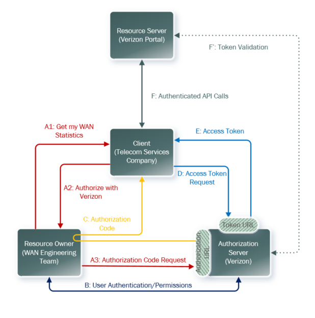

# OAuth2 Three Legged Authorization Flow

In typical authentication workflow, the resource that is being requested has to grant access to the person requesting it. Even if it goes through LDAP for validation it still a process controled by the resource. This becomes particularly problematic when third party applications require access to the resource. The workaround is to grant internal access to an external resource. Not a good plan. 

A solution to this problem is OAuth. OAuth introduces an authorization layer and separates the the roles of the client and the resource owner. 

Instead of using the resource owners credentials. the client obtains an access token that has a specific scope, lifetime, and other access attributes. 

## OAuth Roles

There are four OAuth Roles:
1. Resource Owner: the end user
2. Client: the application that requests access to the RO's data
3. Resource Server: Hosts the protected content that the client requests access to
4. Authorization Server: Verifies identity and issues tokens to the client

## OAuth Grant Types

OAuth has two broad grant types. Gran types can be broadly split into *two-legged* and *three-legged* variants. 
1. Two legged: Does not involve user interaction and usually meant for machine to machine
2. Three legged: Does involve the user and is typically used for applications that users use via web gui

Before you can use OAuth, the client needs to be registered with the Authorization server. When registering they typically get a *client ID* and provide a *callback url* to be redirected to after auth is complete. The auth server will also issue the client a *client secret*. 

The grant types are:
- Authorization Code grant: Exchange an auth code for an access token *Three-legged*
- Client Credentials grant: Obtain an access token without a user *Two-Legged*
- Refresh Token grant: refresh an auth token without reauthentication
- Device Code grant: Used on browserless devices
- Password Credentials grant (Legacy): User's creds are exchanged for an access token

## Three Legged Auth Flow

### (A)

Resource Owner wants Client to access Verizon's WAN connection statistics. Client initiates the OAuth process by directing the owner to the Authorization Server.

### (B)
 Resource owner decides whether to grant the requested app to the client .

### (C)

If the resource owner grants access, the auth server redirects the user back to the client. 

### (D)

The client exchanges the auth code for the token.

### (E)

The authorization server authenticates the client. 

### (F)

The client accesses protected resources.

### Authorization Code Request Elements

1. Response Type
2. Scope
3. Client ID
4. State
5. Redirection URL

### Client Authorization Code Request Parameters
1. Grant Type
2. Client Authentication
3. Code
4. Redirect URL

The two step authentication process, steps A and B are necessary for security by separating out the Client Secret privacy from the Access token privacy. 
