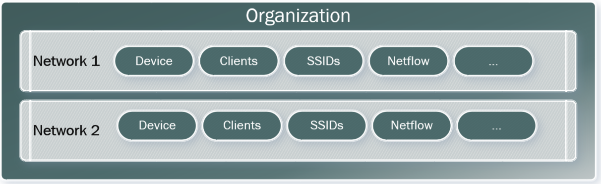

# Meraki API

The Meraki API structure mirrors the structure that the dashboard has like so:

 

 ## Use Meraki Dashboard APIs to enable an SSID

 Typical sequence to manage a network setting:
 1. List the available organizations and find the target organizationId
 2. List the available networks for the orgId and find the target networkID
 3. List the available SSIDs for the networkID and find the target SSID number
 4. Get the detailed info or update the SSID configuration by the SSID number. 

Example URL that follows the above structure:
*It appears that you do not need the org id in every request. The network id will be unique.*
https://api.meraki.com/api/v0/networks/L_63444459000000000/ssids/9

## Use Meraki location APIs to retrieve location data

This uses the Scanning API to retreive this information. It appears that is sends this information as a webhook rather then having users request it. More of a telemetry versus a polling approach. \
